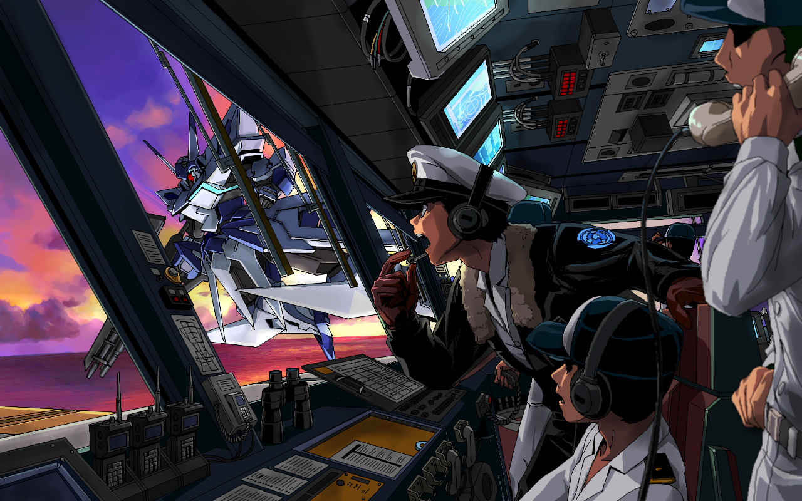

# ガンダム二次創作TRPG - えむげん式1.0

## 概要

本ゲームは、ガンダムのTVシリーズのような物語が量産されるようなTRPGを目指しています。
まずはじめに、「01_基本ルール」の各内容をご確認ください。

### 主な狙い

+ シナリオを管理・準備する担当の負担の軽減
+ 小さく手軽に遊べるTRPG
+ そのための、停滞のしようのない構造

## 特色

セッション中の「脅威」やその対処の過程・結末に応じて、みんなでシナリオの肉付けをしていきながら、最後の区間での脅威をなるべく少なくするにはどうしたらいいかを試行錯誤するゲームです。

そのため、肉付けは、プレーヤーにもシナリオ面での幅広い想像力を要求する分、自由な肉付けが可能です。

